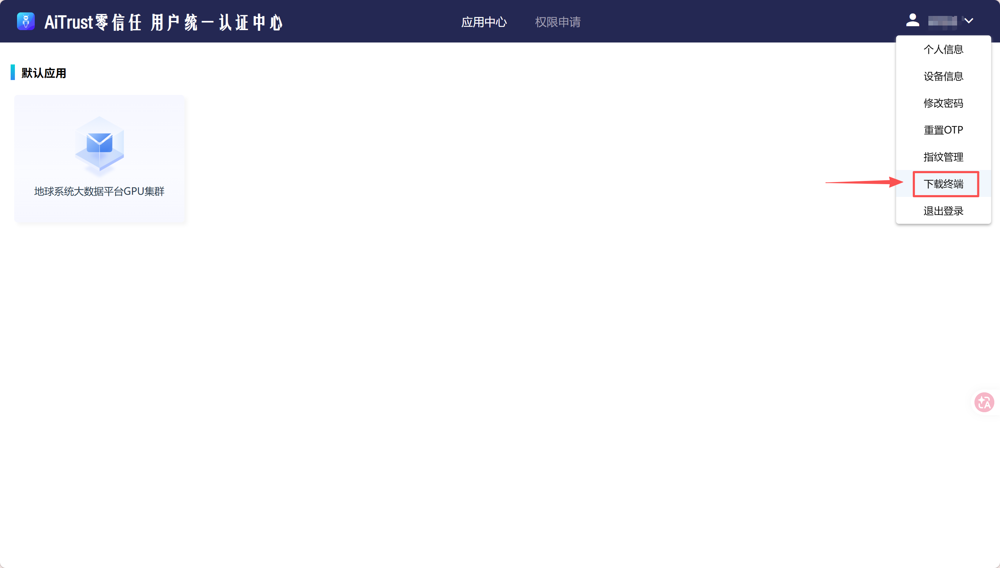
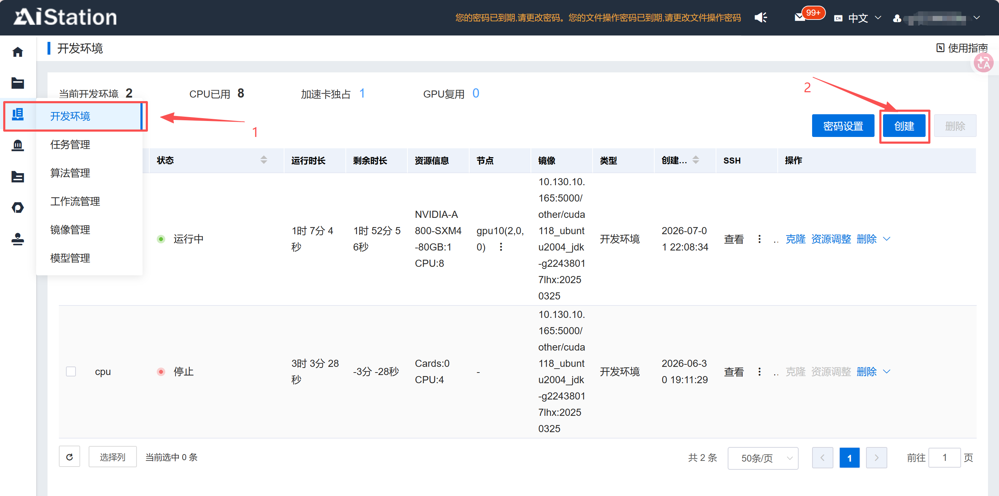
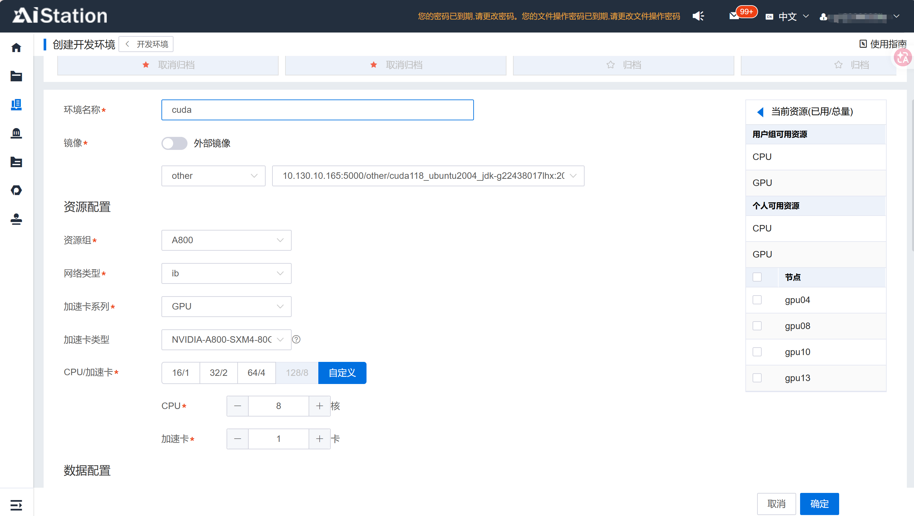
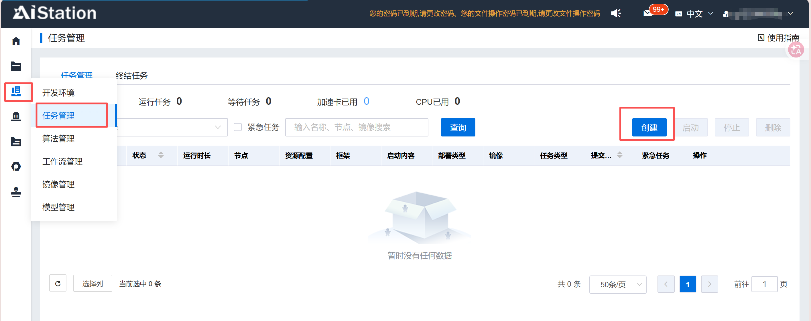

# 学院服务器平台（AiStation）使用指南

---

## 1. 登录平台

平台有两步骤认证，暂时称为软件登录和网页登录。首先需要在tgent软件认证。下载地址在[AiTrust零信任](esbd.zju.edu.cn)

### 1.1 软件登录

- 连接地址：esbd.zju.edu.cn
- 账密登录

### 1.2 网页登录

- 同一个账号，另一个密码登录

---

## 2. 创建环境

- 学院平台基于Docker管理，只需要知道每个人的工作区互相独立即可。需要通过ssh连接到创建好的环境。
- windows/mac 的terminal都可以完成ssh连接服务器的任务。
- 但为了后续浏览文件方便，建议下载 VSCode，使用 VSCode 的 Remote - SSH 插件。

### 2.2 创建开发环境

- 入口位置
  
- 基础配置（名称、镜像选择、资源规格）
  
- 存储挂载（数据集/代码目录）
  推荐按照我的配置一比一复刻。

| Data Path                  | Mount Path             | Usage      | Mount Type |
| -------------------------- | ---------------------- | ---------- | ---------- |
| /<USER_PATH>/vscode-server | /root/.vscode-server   | Direct use | Normal     |
| /<USER_PATH>/envs          | /root/miniforge3/envs/ | Direct use | Normal     |
| /<USER_PATH>/code          | /workspace/code        | Direct use | Normal     |

- 其他不用管

---

## 3. 创建训练任务

- 入口位置
  
- 基本配置：和 创建环境 一致
- 启动命令填写：填写bash命令，例如`bash xxx.sh`
