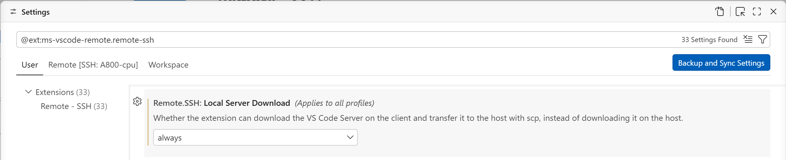

# VSCode Server 手动安装/无网络安装

首先，安装 VSCode Server 和 Remote - SSH 插件。

但到这一步为止，还不能顺利连上服务器，因为使用Remote-SSH的时候需要在服务器上下载一个 vscode-server ，这个下载过程需要联网。

并且，配置的SSH反向代理仅活跃在当前会话，**并不会自动传给 VS Code Remote-SSH 用来安装 `.vscode-server` 的那条 SSH 会话** 。


# 方案一（推荐）

手动本地下载，手动配置远程目录。请参考：[VSCode Server 手动安装/无网络安装](https://zhuanlan.zhihu.com/p/2041176071022829953)


# 方案二

该方案理论可以，但据我测试不顺利

设置 Remote - SSH，优先让 VS Code 在本地下载 server，再传到远程。



```
"remote.SSH.localServerDownload": "always"
```

这样 `.vscode-server` 不需要远程服务器自己联网下载。
